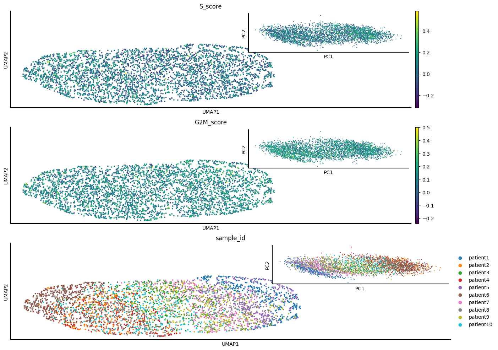

.. _coders:

CanSig as a package
===================  

Although CanSig can be used a standalone pipeline, it can also be used as a Python package in a customary script or a `Jupyter notebook <https://jupyter.org/>`_.

We assume that the CanSig package has been installed and the example data set has been downloaded. Generally, CanSig can be applied to integrate the *malignant* cells and cluster them into subtypes.
For example, one can use a data set from `Curated Cancer Cell Atlas <https://www.weizmann.ac.il/sites/3CA/>`_

CanSig uses `scVI <https://scvi-tools.org/>`_ to integrate the cells into a shared representation space.
Let's do it, adding ``S_score`` and ``G2M_score`` columns as covariates:

.. code-block:: python
   
   import pandas as pd
   import matplotlib.pyplot as plt
   import numpy as np
   import scanpy as sc
   import seaborn as sns
   
   import cansig
   from cansig.run.integration import integrate_adata
   
   data = sc.read_h5ad("data/tutorial/simulated/malignant.h5ad")
   
   integration_config = cansig.models.scvi.SCVIConfig(
       batch="sample_id",
       n_latent=3,
       random_seed=0,
       train=cansig.models.scvi.TrainConfig(max_epochs=50),
       continuous_covariates=["S_score", "G2M_score"],
       discrete_covariates=None,
   )
   
   representations = integrate_adata(
       data=data,
       config=integration_config,
   )

   # A pandas DataFrame
   representations.head()

   # The order corresponds to the original data set:
   np.all(representations.index == data.obs.index)

In a similar manner one can train several different models (corresponding to random seeds or different hyperparameters).

Having the representations, we can cluster them:

.. code-block:: python

   cluster_config = cansig.cluster.api.LeidenNClusterConfig(clusters=5)
   cluster_algorithm = cansig.cluster.api.LeidenNCluster(cluster_config)
   labels = cluster_algorithm.fit_predict(representations.values)
   data.obs["label"] = pd.Categorical(labels)

We can also visualise the data:

.. code-block:: python

   plotting_config = cansig.plotting.plotting.ScatterPlotConfig(
       dim_reduction="both",
       signature_columns=["S_score","G2M_score"],
       batch_column="sample_id",
       ncols=1,
   )
   scatter = cansig.plotting.plotting.ScatterPlot(plotting_config)
   fig = scatter.plot_scatter(adata=data, representations=representations)

Alternatively, one could also use `ScanPy <https://scanpy.readthedocs.io/en/stable/>`_.

We can also run gene set enrichment analysis in the "one vs. rest" fashion for each cluster:

.. note:: 
   While it is a popular step in scRNA-seq workflows, it increases false positives. See `A. Neufeld et al. <https://arxiv.org/abs/2207.00554>`_ for more discussion and remedies.

.. code-block:: python
   
   gsea_config = cansig.gsea.GeneExpressionConfig(
       gene_sets="data/tutorial/simulated/msigdb74.gmt",
       cluster_name=cluster_col,
       method="wilcoxon",
   )
   gex_object = cansig.gsea.gex_factory(cluster_name="label", config=gsea_config)
   gene_ranks = gex_object.diff_gex(data)

For example, to see the genes which differentiate cluster ``1`` from the other clusters, run

.. code-block:: python

   gene_ranks['1'].head(10)

This should result in a data frame:

.. raw:: html

   <table border="1" class="dataframe">  <thead>    <tr style="text-align: right;">      <th></th>      <th>zscores</th>      <th>pvals</th>      <th>qvals</th>    </tr>  </thead>  <tbody>    <tr>      <th>CLEC2D</th>      <td>12.669895</td>      <td>8.683042e-37</td>      <td>1.113210e-34</td>    </tr>    <tr>      <th>RAB5B</th>      <td>12.077424</td>      <td>1.390073e-33</td>      <td>1.579629e-31</td>    </tr>    <tr>      <th>SMARCC2</th>      <td>11.907646</td>      <td>1.079822e-32</td>      <td>1.173720e-30</td>    </tr>    <tr>      <th>RELB</th>      <td>11.658476</td>      <td>2.077275e-31</td>      <td>1.997380e-29</td>    </tr>    <tr>      <th>BABAM1</th>      <td>11.224934</td>      <td>3.076161e-29</td>      <td>2.698386e-27</td>    </tr>    <tr>      <th>RPL18A</th>      <td>11.038743</td>      <td>2.484851e-28</td>      <td>2.036763e-26</td>    </tr>    <tr>      <th>CAPNS1</th>      <td>10.806361</td>      <td>3.211589e-27</td>      <td>2.509054e-25</td>    </tr>    <tr>      <th>CLPP</th>      <td>10.635210</td>      <td>2.043678e-26</td>      <td>1.572060e-24</td>    </tr>    <tr>      <th>MRPS35</th>      <td>10.195406</td>      <td>2.078744e-24</td>      <td>1.443572e-22</td>    </tr>    <tr>      <th>APOC1</th>      <td>9.872516</td>      <td>5.477356e-23</td>      <td>3.423347e-21</td>    </tr>  </tbody></table>

.. note::

   The q-values here are not adjusted for multiple comparisons on the cluster level (we run GSEA for different clusters, so there is a multiple comparison problem) and they may be too small.

This ends up the overview of the utilities in CanSig. For more information we recommend taking a look at the :ref:`API <api>`.

