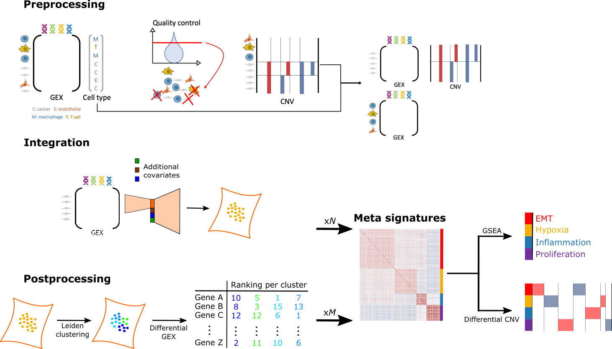
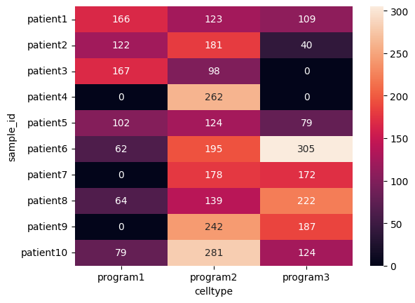
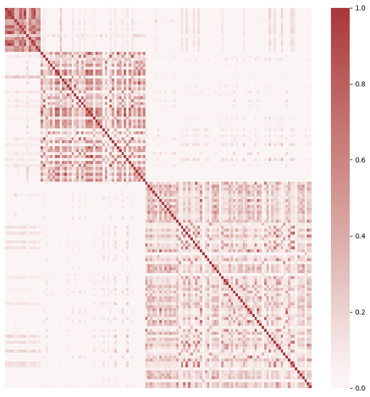
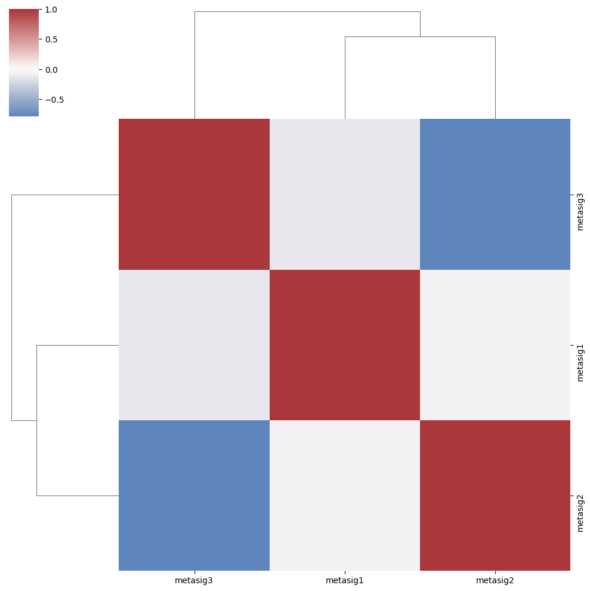
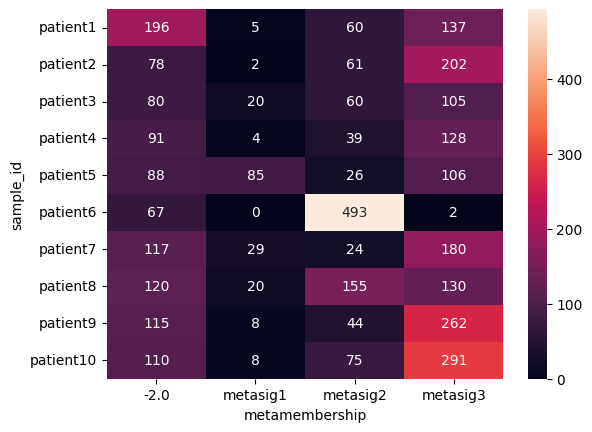
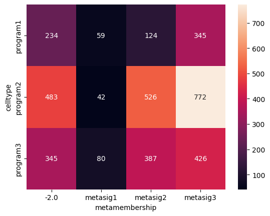

CanSig: discovering cancer signatures
=====================================

Human tumors are highly heterogeneous in their cell composition; specifically, they exhibit heterogeneity in transcriptional states of malignant cells, as has been recently discovered through single-cell RNA sequencing (scRNA-seq). Distinct states of malignant cells have been linked to variability in tumorigenic properties and resistance to anti-cancer treatment. Despite the fact that scRNA-seq data contain all necessary information to uncover shared transcriptional states of malignant cells in tumors, jointly analyzing cells from multiple cancer patients comes with its set of challenges including batch correction and accounting for patient-specific genetic background driving differences between gene expression vectors. We propose CanSig, an easy-to-use approach designed to discover known and de novo shared signatures in cancer single cells. CanSig preprocesses, integrates and analyzes scRNA-seq data to provide new signatures of shared transcriptional states and links these states to known pathways.

.. note::
   A preprint describing the pipeline and case studies is `now available <https://doi.org/10.1101/2022.04.14.488324>`_.

Navigation
----------

.. toctree::
   :maxdepth: 2
   :caption: Contents:

   preprocessing
   pipeline-advanced
   formatting-data
   cansig-for-python-coders
   troubleshooting
   contributing

* :ref:`genindex`
* :ref:`modindex`
* :ref:`search`

Getting started
---------------

Installation
^^^^^^^^^^^^

This tutorial assumes you have access to a Unix terminal (e.g., Linux, BSD, MacOS). If you use Windows, install `Windows Subsystem for Linux <https://docs.microsoft.com/en-us/windows/wsl/install>`_ first.

When the Unix terminal is ready, you will need to `install Python <https://wiki.python.org/moin/BeginnersGuide>`_. One popular solution is `Anaconda <https://www.anaconda.com/>`_.

.. note:: CanSig requires Python 3.8 (or a most recent version).

Install the package:

.. code-block:: bash

   $ pip install cansig

Alternatively, in the `repository <https://github.com/boevalab/cansig>`_ we provide an ``environment.yml`` file `which can be used to create a new conda environment <https://conda.io/projects/conda/en/latest/user-guide/tasks/manage-environments.html#creating-an-environment-from-an-environment-yml-file>`_.

Example dataset
^^^^^^^^^^^^^^^

We will download the example data set using an auxiliary script:

.. code-block:: bash

   $ python -m cansig.run.download

You should see a new directory ``data``:

.. code-block:: bash

   $ ls data/tutorial/simulated
   malignant.h5ad  msigdb74.gmt  README.md

This directory contains a H5AD file with *simulated* malignant cells and a GMT file with gene signatures. More information about these are in the README file.

For convenience we will `define variables <https://linuxhint.com/variables_bash/>`_ storing the locations:

Let's take a look at this data set. Note that T. Chari and L. Pachter in `The Specious Art of Single-Cell Genomics <https://doi.org/10.1101/2021.08.25.457696>`_ demonstrate that single-cell data is hard to visualise and popular dimension reduction strategies may lead to spurious conclusions.

We will use UMAP for demonstratory purposes to demonstrate the signals in the data we simulated. We suggest to install and run `Jupyter Notebook <https://jupyter.org/>`_ for this.

Once the notebook is running, we can load the data:

.. code-block:: python

   import scanpy as sc
   import seaborn as sns

   data = sc.read_h5ad("data/tutorial/simulated/malignant.h5ad")
   sc.pp.neighbors(data)
   sc.tl.umap(data)
   sc.pl.umap(data, color=["sample_id", "celltype", "subclonal"], ncols=1)

.. image:: img/tutorial-simulated-umap.png
  :width: 400
  :alt: UMAP visualisation of simulated cells.

We simulated samples coming from different patients, with different subclonal composition and different malignant cell types.
Different patients may be missing some of the cell types. Let's visualise how many cells with particular cell type are within each sample:

.. code-block:: python

   def plot_joint(col1: str, col2: str):
      return sns.heatmap(data
                         .obs
                         .groupby([col1, col2])
                         .size()
                         .reset_index()
                         .pivot(index=col1, columns=col2, values=0),
                         annot=True,
                         fmt="g",
                        )

   plot_joint("sample_id", "celltype")

Running the analysis
^^^^^^^^^^^^^^^^^^^^

As we know what we can expect in this data set, we will run the analysis:

.. code-block:: bash

   $ python -m cansig.run.pipeline data/tutorial/simulated/malignant.h5ad 
                                   --gene-sets data/tutorial/simulated/msigdb74.gmt
                                   --output tutorial-output 
                                   --batch sample_id
                                   --n-top-genes 2000
                                   --dimensions 4 6 8
                                   --model-runs 1
                                   --clusters 4 6 8 10
                                   --cluster-runs 2
                                   --max-epochs 200

Apart from specifying the data and gene sets location we specified the output path ``tutorial-output`` and the column with experimental batch variable ``sample_id``, as CanSig will try to remove batch effects using `scVI <https://scvi-tools.org/>`_. We will do the data integration step for three latent space dimensionalities (``--dimensions 4 6 8``). We will train each of these models once (``--model-runs 1``), although one could also ablate the influence to random seed choice by increasing this value. Each model will be trained for maximally 200 epochs.

We will also do the Leiden clustering into 4, 6, 8, and 10 clusters. For each number of clusters we will run the Leiden clustering twice (``--cluster-runs 2``) as this is a randomised algorithm.

This step should take up to thirty minutes on a computer with modern GPU. For computers with access only to CPU it is possible to run the pipeline for a smaller number of models or training them for shorter time, although this may affect the results.

Additional options are visible by using the ``--help`` flag:

.. note::

   In case of additional continuous or discrete variables, which may confound the expression (e.g., the sequencing technology used), one could specify it via the ``--continuous-covariates`` and ``--discrete-covariates`` flags.
   
   For more information, run 

   ``$ python -m cansig.run.pipeline --help``

After the command has finished running, the results will be available in the generated directory ``tutorial-output/``.

Let's analyse its structure.

* ``integration/``: each integration model has a separate directory representing the latent representations inferred by the batch correction/dimension reduction method.
   * ``{rundir}/integration-settings.json``: summary of the parameters used for the integration method.
   * ``{rundir}/latent-representations.csv``: coordinates in the latent space inferred by the integration method.
* ``postprocessing/``: each clustering configuration on each model has a separate directory with the postprocessing information saved.
   * ``{rundir}/cluster-labels.csv``: cluster assignments for this run .
   * ``{rundir}/cluster-settings.json``: summary of the parameters used for the clustering step.
   * ``{rundir}/gsea-dataframe.csv``: results of GSEA run in this setting (full table, including non-significant pathways and negative enrichment score pathways).
   * ``{rundir}/gsea-settings.json``: summary of the parameters used for the GSEA run.
   * ``{rundir}/integration-settings.json``: summary of the parameters used for the integration method.
   * ``{rundir}/latent-space-dimred.png``: scatter plot of the PCA on the latent space colored according to batch and clustering.
   * ``{rundir}/signatures/``: directory containing the de novo signatures as the results of the differential gene expression analysis.
      * ``signature_cl{CLUSTER}.csv``: results of the differential gene expression analysis for cluster CLUSTER, ranked according to z-score. 
* ``metasignatures/``: summary of the runs obtained by clustering the signatures from different postprocessing directories.
      * ``signatures/``: contains the files with the clustered signatures ("meta-signatures").
      * ``cell-metamembership.csv``: cells assigned to their meta-signatures.
      * ``similarity-matrix.csv``: similarity between different postprocessing runs, used to create meta-signatures.
      * ``figures/``: generated figures
          * ``heatmap-metasignatures.png``: visualisation of the similarity between different postprocessing runs, used to create meta-signatures.
          * ``clustermap-metasignatures-correlation.png``: correlation between cell scores obtained via scoring with meta-signatures.

For example, the similarity between used to create metasignatures in our case looks in the following manner:

so one can hope that there are three different meta-signatures. When the cells are scored according to them the following correlation matrix is obtained:

.. note::

   Each directory in ``postprocessing/`` is a result of running integration method, clustering, and gene set enrichment analysis. We ablate the hyperparameters and  in ``metasignatures/`` we assemble this information to hope that the aggregated results will be more robust to changes in hyperparameters. Note that there are many possible ways of doing it and perfectly one would apply resampling techniques, such as bootstrap, to understand whether the final output is robust enough.
   We advise to use CanSig with this limitation in mind and we recommend `F. Harrell's blogpost <https://www.fharrell.com/post/badb/index.html>`_ for an excellent overview of robust biomarker research.

Comparing with the ground truth
^^^^^^^^^^^^^^^^^^^^^^^^^^^^^^^

As we mentioned above, unsupervised learning and scientific discovery are hard problems and although CanSig can be used for exploratory data analysis, it is *not* a replacement for additional validation (by means of putting the findings in the wider biological context, using appropriate bootstrapping technique, and designing wet-lab interventional studies).
We can however see how well the found metasignatures correspond to the cell types in the simulated data.

Let's open Jupyter and run the following code:

.. code-block:: python

   import pandas as pd
   import scanpy as sc
   import seaborn as sns

   def plot_joint(col1: str, col2: str):
       return sns.heatmap(data
                          .obs
                          .groupby([col1, col2])
                          .size()
                          .reset_index()
                          .pivot(index=col1, columns=col2, values=0),
                          annot=True,
                          fmt="g",
                         )

   # Load the simulated cells
   data = sc.read_h5ad("data/tutorial/simulated/malignant.h5ad")
   
   # Load the meta-signatures
   metamembership = pd.read_csv("tutorial-output/metasignatures/cell-metamembership.csv", index_col=0)

   # Add the meta-signatures membership to the data
   data.obs["metamembership"] = metamembership.loc[data.obs.index]

   plot_joint("sample_id", "metamembership")

As we can see, the cells have been decomposed into three meta-signatures as well as undetermined cells.

We can also visualise the (empirical) joint distribution of ground truth cell types and assigned memberships to meta-signatures:

.. code-block:: python

   plot_joint("celltype", "metamembership")

It seems that ``metasig1`` is considerably smaller than the other meta-signatures as well as the set of undetermined cells. We see that for both types ``metasig2`` or ``metasig3`` seem to be mostly capturing ``program2`` and ``program3``.

Tutorials
---------

* To learn more about the command line pipeline, see :ref:`pipeline-advanced`.
* To learn how to run CanSig elements in a Python script or a Jupyter notebook, see :ref:`CanSig as a package <coders>`.
* To learn about the preprocessing module (used to prepare the raw data into the .h5ad format), see the :ref:`preprocessing`.
* To learn how to format already preprocessed .csv files into .h5ad files, see :ref:`formatting`.
* To ensure smooth running of CanSig, check out :ref:`the troubleshooting page <troubleshooting>`. 

Contributing
------------

For the contribution guide and instructions for new developers, see :ref:`contribution-guide`.

